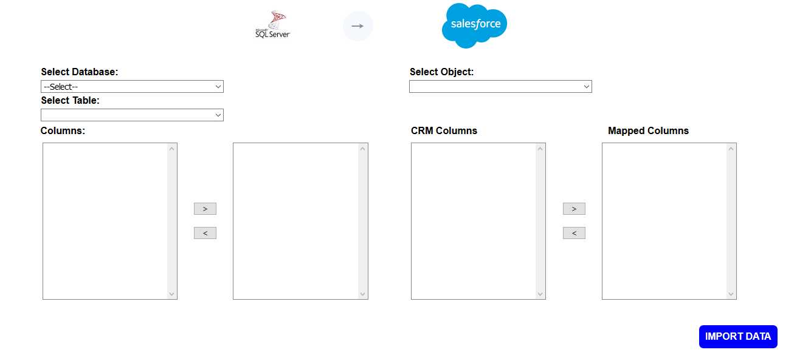
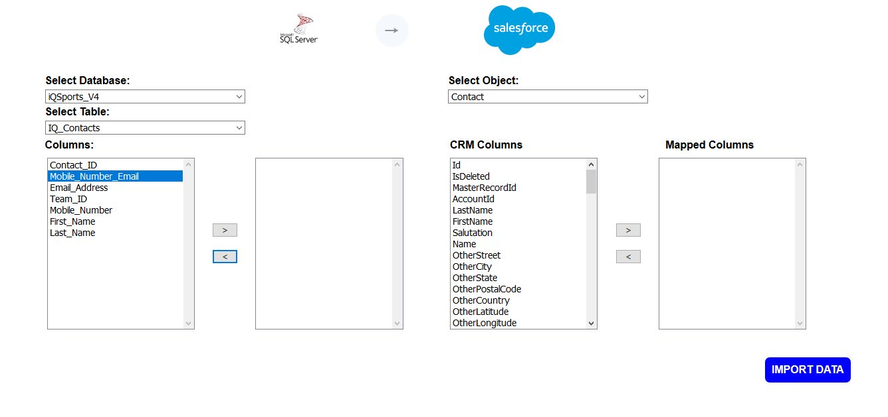
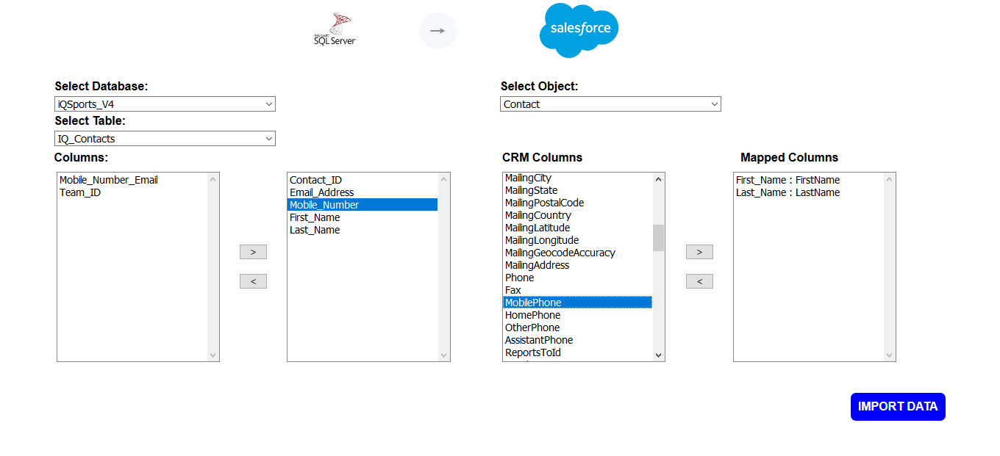
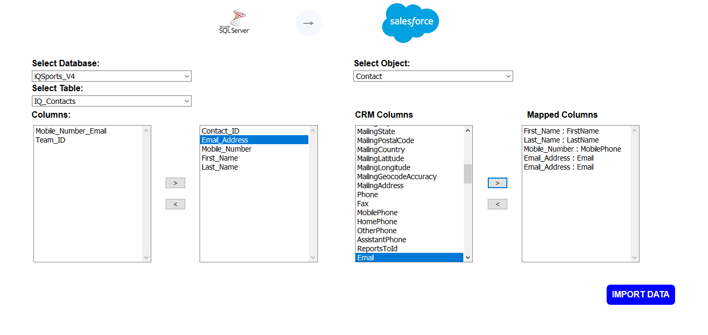

# API
## Salesforce
### iQ Sports and iQ Gaming App
contributed by [Nayeemuddin Shaik](mailto:Nayeemuddin.Shaik@qlx.com)

- - - 

This app is installable in any Salesforce Environment, with this installation all the required components like  object(table) and fields(Columns) will be installed in salesforce

Links to install app in Salesforce

[iQ Sports](https://login.salesforce.com/packaging/installPackage.apexp?p0=04t2G000000FiML)

[iQ Gaming](https://login.salesforce.com/packaging/installPackage.apexp?p0=04t2G000000FiMa)

After installing the App we can integrate the app with database for transfer of data or daily loading the incremental load we can use the below integration codes.

**NOTE:** You must place the **[Salesforce username and keys of the organization](https://help.salesforce.com/articleView?id=security_keys_about.htm&type=5)** in the appropriate location.

- - -

### 1. Salesforce Excutable for SQL Integration :

```
    > cd SQL_Executable
    > ls
```

In the above folder you will find the EXE file and ***appcfg.xml*** file, In the ***appcfg.xml*** file we need to pass the Salesforce credentials and database  tables, save it and  then run the exe file.

**For Windows**

- The .NET code API ( SQL TO SF) is the core code if we need any modifications we need to do in this code.

- After compiling the code we will generate the exe file from  it which is attached below.

- If we need it as it is without changing requirements then don't need for compiling it we can use the exe file folder directly by adding the below steps to it.

- In this there is an appcfg.xml file where we need to pass -

	a. Salesforce credentials

	b. Database connection

	c. Mapping Table name

	d. Source table name

- On Windows, run SQLtoSF.exe

- - -

### 2. Salesforce Integration with SQL :

```
    > cd SQL_Integration
    > ls
```

This is a console code API application developed in C# .net
      
With this code we can load data from sqlserver to salesforce with source table and one mapping sf column table.
      
We can schedule this so that it can run daily by doing insertion and updation according to the matched data.
      
We can customize this code according to the requirement by which columns we need to update and which not to be.

By placing the PHP code in the webserver and running the file we will get the screens below.









For SQL as its console application just needs to run the executable exe file to process. 

- - -

### 3. Salesforce Integration with PHP :

```
    > cd PHP_Integration
    > ls
```

This Code is developed in PHP. 

It is a GUI based api application where we have a screen on one side it shows the Database tables when clicked on the table it shows the columns then other side it shows the salesforce objects when select the object it shows the columns of the object then by selecting and mapping two source table column and SF column then click import it will import all data directly into SF. It is a GUI screen process.


